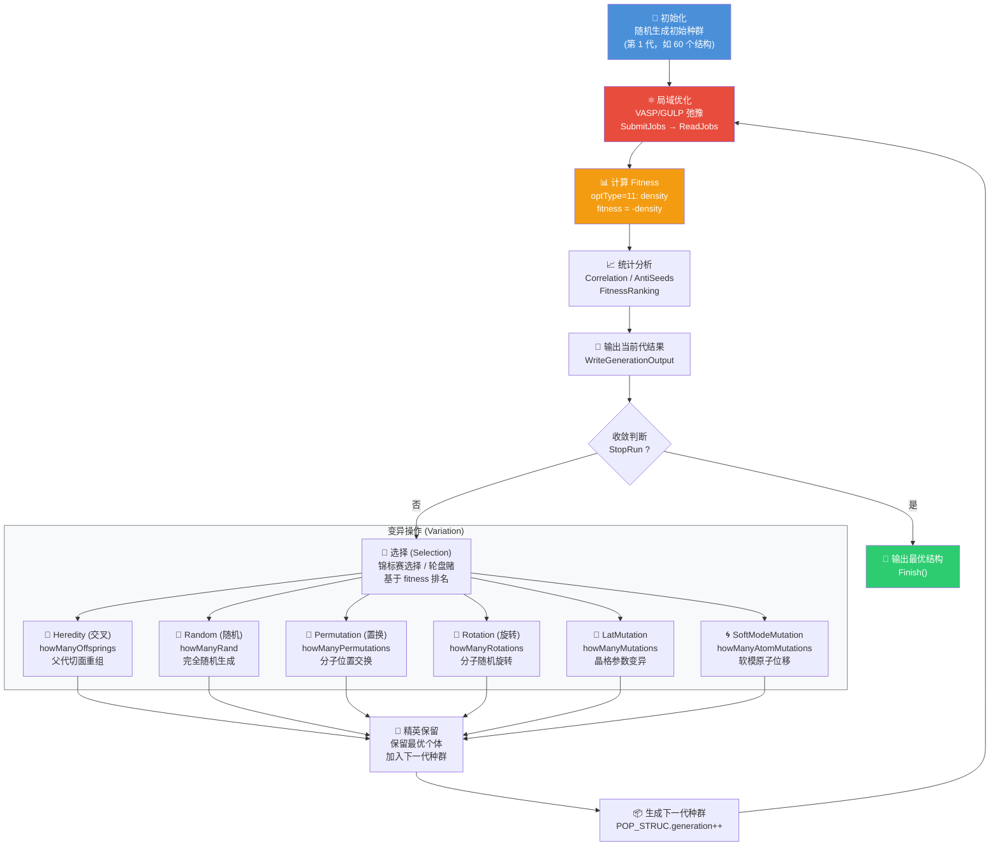

# 标准进化算法 (EA) 晶体结构搜索流程图



## 核心流程说明

### 1. 初始化 (Initialization)
```
随机生成初始种群 → 写入 POSCAR 文件
```

### 2. 局域优化 (Local Optimization)
```
SubmitJobs → 等待 VASP/GULP 完成 → ReadJobs
每个结构弛豫到最近能量极小值
```

### 3. Fitness 计算
```
optType=11:  fitness = -density   (密度最大化)
optType=1:   fitness = Enthalpy   (能量最小化)
...
```

### 4. 选择 (Selection)
```
基于 fitness 排序 → 锦标赛选择 → 选出父代
```

### 5. 变异操作 (对应 USPEX EA_310.m)
| 操作 | 数量参数 | 说明 |
|------|---------|------|
| Heredity | howManyOffsprings | 两个父代切面重组 |
| Random | howManyRand | 完全随机生成 |
| Permutation | howManyPermutations | 分子位置交换 |
| Rotation | howManyRotations | 分子随机旋转 |
| LatMutation | howManyMutations | 晶格参数变异 |
| SoftModeMutation | howManyAtomMutations | 软模原子位移 |

### 6. 精英保留 (Elitism)
```
最优个体直接进入下一代，防止退化
```

### 7. 收敛判断
```
StopRun: 检查 fitness 是否收敛
         generation 是否达到上限
```

## 关键数据结构

```
POP_STRUC.POPULATION(i)
  ├── .LATTICE        (3x3 晶格矩阵)
  ├── .COORDINATES    (原子坐标)
  ├── .numIons        (原子种类及数量)
  ├── .Enthalpies     (局域优化后的能量)
  ├── .Number         (全局 bodyCount)
  ├── .FINGERPRINT    (结构指纹)
  └── .Done           (局域优化是否完成)

ORG_STRUC
  ├── .numGenerations     (最大代数)
  ├── .optType            (fitness 类型，310=11)
  ├── .howManyOffsprings  (交叉子代数)
  ├── .howManyRand        (随机子代数)
  └── ...
```

## 与 GPML 增强版的对比

| 阶段 | 标准 EA | EA + GPML |
|------|---------|-----------|
| Fitness | 纯 DFT 密度 | DFT 密度 → GP 预测覆盖 |
| 选择标准 | 当前 fitness | GP 增强后的 fitness |
| 计算成本 | 每代 N 个 DFT | 每代最多 1 个额外 DFT |
| 探索策略 | 纯随机变异 | UCB/EI 引导探索 |
| 模型 | 无 | 高斯过程回归 |