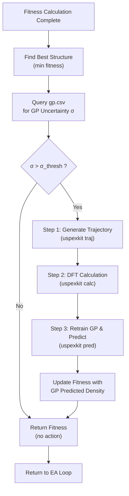

# Uncertainty-Quantification-Driven Active Learning for Crystal Structure Prediction

## Abstract

We present an uncertainty-quantification (UQ) driven active learning framework integrated into the USPEX evolutionary algorithm for crystal structure prediction. At each generation, after fitness evaluation, the Gaussian process (GP) model's predictive uncertainty for the best candidate structure is queried. When the uncertainty exceeds a configurable threshold, a three-stage active learning cycle is triggered: (1) trajectory generation, (2) DFT calculation, and (3) GP retraining with the augmented dataset, followed by fitness update using the refined GP prediction. This closed-loop strategy enables the model to autonomously identify and resolve high-uncertainty regions of the chemical space, improving the accuracy of density predictions for energetic molecular cocrystals.

---

## 1. Introduction

Crystal structure prediction (CSP) of energetic molecular cocrystals poses significant challenges due to the vast configurational space and the high computational cost of density functional theory (DFT) evaluation. Gaussian process regression (GPR) has emerged as a powerful surrogate model for predicting physical properties such as density and energy, offering both point predictions and principled uncertainty estimates. However, the quality of GP predictions critically depends on the coverage of the training dataset.

We propose a UQ-driven active learning strategy that closes the loop between GP prediction and DFT calculation. The key insight is that the GP's predictive variance serves as a reliable indicator of model confidence: structures with high uncertainty are underrepresented in the training set and warrant explicit DFT treatment. By incorporating the DFT result back into the training data and retraining the GP, the model progressively improves its predictive accuracy in regions most relevant to the evolutionary search.

---

## 2. Methodology

### 2.1 Gaussian Process Regression

The GP model employs a composite kernel combining a DotProduct kernel (capturing linear trends), a Matern kernel with $\nu = 1.5$ (capturing smooth non-linear variations), and a WhiteKernel (accounting for noise):

$$k(\mathbf{x}_i, \mathbf{x}_j) = k_{\text{DotProduct}}(\mathbf{x}_i, \mathbf{x}_j) + k_{\text{Matern}_{3/2}}(\mathbf{x}_i, \mathbf{x}_j) + k_{\text{White}}(\mathbf{x}_i, \mathbf{x}_j)$$

The feature vector $\mathbf{x} \in \mathbb{R}^7$ encodes seven structural descriptors derived from ReaxFF-based energy decomposition and hydrogen-bond network analysis. The GP is trained on a dataset of $N$ known structures with DFT-computed densities and energies.

### 2.2 UQ-Driven Active Learning Cycle

The algorithm is implemented as a post-processing step in `CalcFitness_310.m`, executed after the standard fitness evaluation within each generation of the evolutionary algorithm. The procedure is as follows:

**Step 1: Identify the best candidate.** Among all valid structures in the current population (fitness $< 10^5$), the structure with the minimum fitness value is selected. Its crystal index, stored in `POP_STRUC.POPULATION(i).Number`, is used to query the GP database.

**Step 2: Query GP uncertainty.** The GP uncertainty for the selected structure is retrieved from `CalcFold1/gp.csv`, a continuously updated log file containing predictions and uncertainties for all evaluated structures. The file format is:

| Column | Content |
|--------|---------|
| 1 | Row index |
| 2 | Crystal index |
| 3 | Residual |
| 4–6 | Density predictions (min, RF, GP) |
| 7 | **Density uncertainty** ($\sigma$) |
| 8–10 | Energy predictions and uncertainty |

**Step 3: Threshold decision.** If the density uncertainty $\sigma > \sigma_{\text{thresh}}$ (default $\sigma_{\text{thresh}} = 0.04$), the active learning cycle is triggered. The threshold is configurable via the `--u` parameter in `INPUT.txt`.

**Step 4: Active learning cycle.** When triggered, three sub-steps execute:

1. **Trajectory generation** (`uspexkit traj`): An ASE trajectory file (`Individuals.traj`) is generated from the gathered POSCAR files and the Individuals log, providing a unified structure representation.

2. **DFT calculation** (`uspexkit calc`): A high-throughput DFT calculation is performed on the selected structure using the specified number of CPU cores (`--ncpu`) and data directory (`--dat`). The DFT result is appended to the training dataset.

3. **GP retraining and prediction** (`uspexkit pred`): The GP model is retrained on the augmented dataset. The model's predicted density for the target structure is extracted from the output log (`density_predict.log`), and the structure's fitness is updated accordingly:

   $$f_i = - \rho_{\text{GP}}$$

   where $\rho_{\text{GP}}$ is the GP-predicted density. For composite fitness functions combining enthalpy and density, the update rule generalizes to:

   $$f_i = \frac{E_i}{\text{factor}} - \alpha \cdot \rho_{\text{GP}}$$

   with $\alpha$ being the density weight parameter.

### 2.3 Configuration

All parameters are read from the `uspexkit gp` command line in `INPUT.txt`:

```
uspexkit gp --n=24 --data=data11_44_1 --u=0.04
```

| Parameter | Description | Default |
|-----------|-------------|---------|
| `--n` | Number of CPU cores for DFT and GP | 24 |
| `--data` | Path to training data directory | `data` |
| `--u` | Uncertainty threshold for triggering DFT | 0.04 |

---

## 3. Algorithm Flowchart




---

## 4. Implementation Details

The active learning module is implemented in `CalcFitness_310.m` (lines 129–243) within the USPEX 310 molecular crystal prediction workflow. Key implementation features:

- **Graceful degradation**: If `gp.csv` is not found, the module is silently skipped with no effect on the standard USPEX workflow.
- **Idempotent operations**: Pre-existing trajectory files and DFT calculation directories are detected and reused, preventing redundant computation.
- **Octave compatibility**: All operations use Octave-compatible syntax (`csvread`, `strfind`, `system`), ensuring cross-platform compatibility with both MATLAB and GNU Octave.
- **Configurable parameters**: All thresholds and paths are parsed from the existing `INPUT.txt` configuration file, requiring no code changes for different systems.

---

## 5. Application to TNT/CL-20 Energetic Cocrystal

The method was applied to the TNT₄·CL-20₄ energetic molecular cocrystal system (228 atoms, space group $P1$, 4 molecules of each component). The GP model was initially trained on 803 DFT-computed structures with densities ranging from 1.82 to 1.98 g/cm³. The UQ-driven active learning strategy operates alongside the standard USPEX four-step relaxation pipeline: GULP coarse optimization → broken-molecule repair → GULP fine optimization → GP-based prediction and screening.

---

## 6. Conclusion

We have developed a UQ-driven active learning framework that integrates seamlessly into the USPEX evolutionary algorithm. By leveraging the GP model's built-in uncertainty estimates, the framework autonomously identifies structures that would benefit from explicit DFT evaluation, retrains the GP model with the augmented dataset, and feeds improved predictions back into the fitness calculation. This closed-loop approach reduces the reliance on static training datasets and enables the GP model to adapt to the evolving chemical space explored by the evolutionary search, ultimately improving the accuracy of crystal structure prediction for complex molecular cocrystals.

---

## Appendix: Excalidraw Diagram

The interactive flowchart is available as `docs/uq_active_learning.excalidraw` and can be opened at [excalidraw.com](https://excalidraw.com).