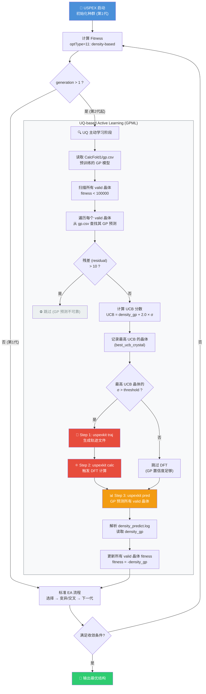
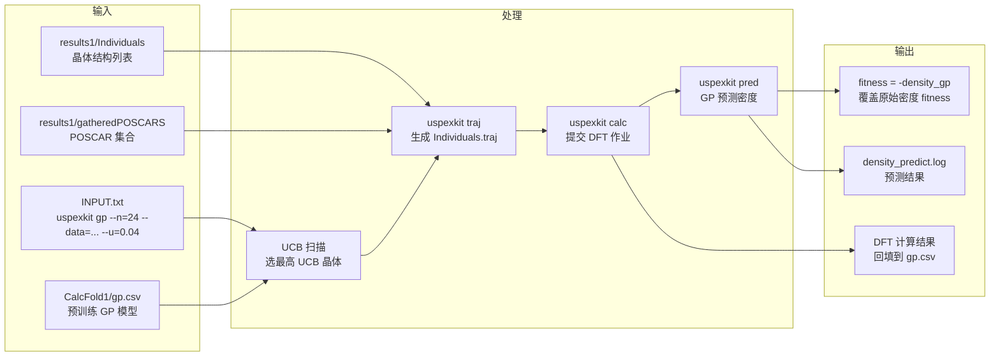

# USPEX 310 进化算法 + 高斯过程机器学习 (GPML) 主动学习

## 算法机理流程图



## 核心公式

### UCB (Upper Confidence Bound) 采集函数

$$UCB = \hat{\mu}(x) + \kappa \cdot \hat{\sigma}(x)$$

其中：
- $\hat{\mu}(x)$ = GP 预测的密度 (`density_gp`，gp.csv col6)
- $\hat{\sigma}(x)$ = GP 预测的不确定性 (`uncertainty`，gp.csv col7)
- $\kappa = 2.0$ (exploration-exploitation 平衡系数)

### 关键决策逻辑

```
if UCB_crystal.σ > u_threshold:
    → 触发 DFT 计算 (探索高不确定性区域)
else:
    → 跳过 DFT (GP 已有足够置信度)
```

### 残差过滤

```
if residual > 10:
    → 该晶体不参与 UCB 竞争 (GP 预测质量太差)
```

## 数据流



## 索引体系

| 索引 | 范围 | 存储位置 | 用途 |
|------|------|---------|------|
| `bodyCount` | 全局累加 (如 268, 271...) | `POP_STRUC.POPULATION(i).Number` | gp.csv col2, calc/pred --ids, density_predict.log col1 |
| `valid_idx` | 当前代 1..N | `find(fitness < 100000)` | POP_STRUC 本地索引 |
| `Individuals` 行号 | 跨代累加 (1-based) | Individuals 文件 | 与 Individuals.traj 一致 |

## 参数说明

| 参数 | 来源 | 默认值 | 说明 |
|------|------|--------|------|
| `ncpu` | `--n=` | 8 | 并行计算核数 |
| `dat_dir` | `--data=` | `'data'` | GP 训练数据目录 |
| `u_threshold` | `--u=` | 0.04 | 不确定性阈值，超过则触发 DFT |
| `kappa` | 硬编码 | 2.0 | UCB 探索系数 |
| `residual_max` | 硬编码 | 10 | 残差过滤阈值 |
| `CalcFold` | 硬编码 | `CalcFold1` | GP 模型存储目录 |